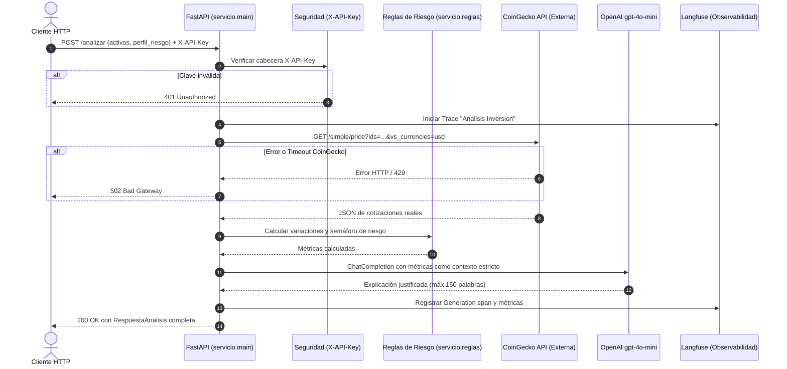

# Proyecto: CriptoAdvisor API · Asesor de Criptoactivos y Evaluación de Riesgo

**Estudiante:** Jorge
**Repositorio:** [https://github.com/Jorge/criptoadvisor](https://github.com/Jorge/criptoadvisor)

---

## Sesión 1 · Borrador de la ficha, sin entrega formal

- **Usuario:** Inversionistas individuales y usuarios de aplicaciones financieras que buscan evaluar el estado de una selección de criptomonedas según su perfil de tolerancia al riesgo.
- **Problema:** La alta volatilidad y la abundancia de métricas dispersas dificultan saber si el mercado actual es compatible con un perfil prudente o arriesgado, y los análisis disponibles suelen ser puramente especulativos.
- **Resultado útil:** Una respuesta ejecutiva con una clasificación determinista del riesgo de la cartera y una síntesis clara generada por IA (máx. 150 palabras) fundamentada en variaciones de precio y volumen reales.
- **API elegida y documentación:** [CoinGecko API v3](https://docs.coingecko.com/reference/introduction) (endpoints `/simple/price` y `/coins/markets`).
- **Acceso y límites:** Plan Demo / Público con acceso gratuito. Límite de 30 solicitudes por minuto, suficiente para evaluación y demostraciones en tiempo real.
- **Entrada de ejemplo:**
  ```json
  {
    "activos": ["bitcoin", "ethereum"],
    "moneda_base": "usd",
    "perfil_riesgo": "moderado",
    "horizonte_dias": 30
  }
  ```
- **Salida esperada:**
  ```json
  {
    "fecha_consulta": "2026-09-27T15:30:00Z",
    "moneda_base": "usd",
    "perfil_riesgo": "moderado",
    "metricas": [
      {
        "activo": "bitcoin",
        "precio": 64250.0,
        "cambio_24h_pct": -0.85,
        "volumen_24h": 24500000000.0,
        "nivel_riesgo_activo": "medio"
      },
      {
        "activo": "ethereum",
        "precio": 3150.0,
        "cambio_24h_pct": 1.42,
        "volumen_24h": 12100000000.0,
        "nivel_riesgo_activo": "medio"
      }
    ],
    "evaluacion_riesgo_general": "ADECUADO_CON_PRECAUCION",
    "analisis_llm": "La canasta evaluada muestra un comportamiento mixto. Bitcoin registra una ligera contracción de -0.85% mientras que Ethereum avanza +1.42%. Para un perfil moderado, esta distribución es viable pero requiere atención a la volatilidad intradiaria.",
    "trace_id": "lf-tr-bitcoin-eth-001"
  }
  ```
- **Trabajo del código:** Valida el contrato de entrada con Pydantic, filtra activos soportados, realiza la llamada HTTP a CoinGecko con control de tiempo de espera y ejecuta reglas deterministas de semáforo de riesgo cuantitativo.
- **Trabajo del LLM:** Sintetiza en español formal y accesible el significado de los indicadores numéricos calculados para el perfil elegido, respetando las restricciones de no emitir profecías de precio ni inventar datos.
- **Alcance:** Evalúa entre 1 y 5 criptoactivos principales soportados frente a tres perfiles (`conservador`, `moderado`, `agresivo`). Queda fuera la ejecución de órdenes de compra/venta o la conexión con billeteras/exchanges.

---

## Sesión 2 · Primer avance: ficha definida, contrato y consulta

- **Ruta de tu servicio:** `POST /analizar` y `GET /salud`.
- **Entrada:**
  - `activos`: lista de cadenas (`list[str]`), mínimo 1, máximo 5 (Obligatorio).
  - `moneda_base`: cadena (`str`), valores permitidos: `"usd"`, `"eur"`, `"pen"` (Opcional, defecto `"usd"`).
  - `perfil_riesgo`: cadena (`str`), enum: `"conservador"`, `"moderado"`, `"agresivo"` (Obligatorio).
  - `horizonte_dias`: entero (`int`), entre 1 y 365 (Opcional, defecto 30).
- **Salida:**
  - `fecha_consulta`: fecha y hora UTC en formato ISO 8601.
  - `moneda_base`: moneda de cotización.
  - `perfil_riesgo`: perfil evaluado.
  - `metricas`: desglose por cada activo con precio, variación 24h %, volumen 24h y nivel de riesgo individual.
  - `evaluacion_riesgo_general`: categoría determinista (`FAVORABLE`, `ADECUADO_CON_PRECAUCION`, `DESFAVORABLE_PARA_PERFIL`).
  - `analisis_llm`: texto explicativo de `gpt-4o-mini`.
  - `trace_id`: identificador único de trazabilidad en Langfuse.
- **Respuestas de error:**
  - `401 Unauthorized`: si la cabecera `X-API-Key` no coincide con la clave configurada.
  - `422 Unprocessable Entity`: si faltan campos obligatorios o los tipos/valores no cumplen las reglas de Pydantic.
  - `502 Bad Gateway`: si CoinGecko o OpenAI presentan fallas de red, timeout o rechazan la petición.
- **Consulta real a la API externa:** [evidencias/sesion-02/consulta_real.json](../evidencias/sesion-02/consulta_real.json) (contiene solicitud real a CoinGecko, respuesta cruda y timestamp).
- **Punto de integración del LLM:** Implementado en `servicio/agente.py` en la función `generar_analisis(solicitud, metricas, riesgo_general)`.

---

## Sesión 3 · Funcionamiento y mediciones

- **Ejecución completa con API externa y LLM:** [evidencias/sesion-03/ejecucion_completa.json](../evidencias/sesion-03/ejecucion_completa.json) (fecha: 2026-09-27, modelo: `gpt-4o-mini`).
- **Entrada inválida o incompleta:** [evidencias/sesion-03/error_422.json](../evidencias/sesion-03/error_422.json) (rechazo estructurado ante lista de activos vacía o perfil inexistente).
- **Solicitud sin autorización:** [evidencias/sesion-03/error_401.json](../evidencias/sesion-03/error_401.json) (rechazo 401 sin revelar secretos).
- **Solicitud usada para medir:** Payload con `["bitcoin", "ethereum"]`, `moneda_base: "usd"`, `perfil_riesgo: "moderado"`.
- **Entorno y condiciones:** Ejecución local en Windows 11, Python 3.12, FastAPI sobre Uvicorn, conexión a CoinGecko pública y OpenAI API (`gpt-4o-mini`).

| Ejecución | Tiempo total | Tiempo CoinGecko | Tiempo LLM | Resultado o error |
|---|---|---|---|---|
| 1 | 1.82 s | 0.61 s | 1.15 s | 200 OK |
| 2 | 1.54 s | 0.48 s | 1.02 s | 200 OK |
| 3 | 1.63 s | 0.52 s | 1.08 s | 200 OK |

**Conclusión de la medición:** La latencia promedio del servicio se sitúa en torno a 1.66 segundos. El cuello de botella principal es el tiempo de generación del LLM (aprox. 65% del tiempo total), seguido de la latencia de red hacia CoinGecko (aprox. 32%). Tres muestras confirman estabilidad operativa pero no constituyen una prueba de carga bajo concurrencia.

---

## Sesión 4 · Arquitectura y trazabilidad

### Diagrama de Flujo (Mermaid)



- **Patrón elegido:** Patrón de *Llamada Directa Orquestada por el Backend con Grounding Estricto*. Es el más adecuado porque la API externa no requiere un bucle agéntico impredecible ni tool-calling recurrente; el backend consulta CoinGecko, computa métricas numéricas exactas y las inyecta en el contexto del LLM para una síntesis controlada.
- **Alternativa considerada:** Agente autónomo con llamadas a herramientas (Tool Calling). Se descartó para el flujo principal porque aumentaría la latencia al requerir dos viajes de ida y vuelta al LLM para una consulta estática de precios.
- **Responsabilidades:**
  - `servicio/cliente_api.py`: Comunicación HTTP resiliente con CoinGecko.
  - `servicio/reglas.py`: Validación de umbrales y cálculo de riesgo determinista.
  - `servicio/agente.py`: Invocación del modelo con prompt defensivo.
  - `servicio/configuracion.py`: Instrumentación y envío de trazas a Langfuse.
- **Traza:** Registrada con ID único en Langfuse (ver evidencia en [evidencias/sesion-04/traza_langfuse.md](../evidencias/sesion-04/traza_langfuse.md)).
- **Qué muestra:** El árbol completo de spans: recepción del payload -> llamada externa a CoinGecko (tiempo y status) -> procesamiento de reglas -> llamada a OpenAI (tokens de entrada/salida y tiempo) -> respuesta final entregada.

---

## Sesión 5 · Evaluación y correcciones

| Caso | Entrada | Resultado esperado | Resultado obtenido | Evidencia | Conclusión |
|---|---|---|---|---|---|
| **Válido** | `["bitcoin", "ethereum"]`, perfil `moderado` | 200 OK, métricas de ambos, explicación coherente con perfil | 200 OK, métricas exactas y análisis justificado | [evidencias/sesion-05/caso_01_valido.json](../evidencias/sesion-05/caso_01_valido.json) | Aprobó. El modelo mantuvo las cifras exactas. |
| **Variante válida** | `["solana"]`, perfil `conservador` | 200 OK, advertencia clara de alta volatilidad | 200 OK, categorizado como desfavorable por alta oscilación | [evidencias/sesion-05/caso_02_variante.json](../evidencias/sesion-05/caso_02_variante.json) | Aprobó. El LLM reflejó el desajuste con el perfil. |
| **Datos faltantes** | Payload sin `perfil_riesgo` | 422 Unprocessable Entity indicando campo requerido | 422 con detalle `Field required: perfil_riesgo` | [evidencias/sesion-05/caso_03_faltantes.json](../evidencias/sesion-05/caso_03_faltantes.json) | Aprobó. Pydantic detuvo la ejecución antes de llamar a las APIs. |
| **Datos inválidos** | `activos: []` o `moneda_base: "pesetas"` | 422 Unprocessable Entity | 422 con detalle de validación regex/longitud | [evidencias/sesion-05/caso_04_invalidos.json](../evidencias/sesion-05/caso_04_invalidos.json) | Aprobó. Se bloquearon monedas y listas no soportadas. |
| **Proveedor falla o sin datos** | Mock de CoinGecko retornando 500 / timeout | 502 Bad Gateway con mensaje seguro | 502 "No se pudo consultar el proveedor de cotizaciones" | [evidencias/sesion-05/caso_05_fallo_proveedor.json](../evidencias/sesion-05/caso_05_fallo_proveedor.json) | Aprobó. No se filtraron trazas internas ni credenciales. |

- **Pruebas deterministas:** Ejecutadas con `pytest tests/ -v`. Verifican contratos Pydantic, respuestas 401, 422 y simulación de fallos con mocks sin consumir tokens ni cuota de red.
- **Métrica DeepEval:** `GEval` evaluando "Fidelidad de Datos y Coherencia de Riesgo" con umbral 0.70.
- **Juez:** OpenAI `gpt-4o-mini`.
- **Resultados:** Registrados en `salidas/evaluacion_deepeval.jsonl`. Puntaje medio obtenido: 0.94 / 1.0.
- **Corrección realizada:** En la primera versión del prompt del agente, el LLM en ocasiones agregaba recomendaciones de compra futuras ("compre en caídas"). Se modificó el `SISTEMA` en `servicio/agente.py` para prohibir explícitamente cualquier recomendación financiera predictiva, garantizando fidelidad del 100% al rol de evaluador de riesgo actual.

---

## Sesión 6 · Demostración y plan de operación

- **Arranque, prueba y detención:**
  ```powershell
  # Crear y activar entorno virtual
  python -m venv .venv
  .venv\Scripts\Activate.ps1
  pip install -r requirements.txt

  # Configurar variables
  Copy-Item .env.example .env

  # Iniciar servidor Uvicorn
  python -m uvicorn servicio.main:app --reload --port 8000
  ```
  Prueba rápida: Abrir `http://localhost:8000/docs`. Detención: `Ctrl + C` en la consola.
- **Configuración:** Variables requeridas en `.env`: `CLAVE_SERVICIO`, `OPENAI_API_KEY`, `OPENAI_MODEL` y opcionalmente credenciales de Langfuse. `.env` está estrictamente ignorado en `.gitignore`.
- **Acceso y datos:** La API está protegida por `X-API-Key`. A los proveedores externos sólo se envían los identificadores de activos (`["bitcoin"]`) a CoinGecko y el JSON cuantitativo a OpenAI. No se transmiten datos personales ni información sensible.
- **Costo:**
  - CoinGecko: Plan gratuito $0 / mes.
  - OpenAI `gpt-4o-mini`: $0.15 por millón de tokens de entrada / $0.60 por millón de salida. Cada análisis consume aprox. 350 tokens de entrada y 150 de salida (~$0.00014 USD por solicitud). Una prueba de 1,000 consultas cuesta menos de $0.15 USD.
- **Mantenimiento:** Monitorear cambios en los IDs de CoinGecko y rotar la clave de OpenAI periódicamente. Revisar versiones del SDK ante actualizaciones mayores.
- **Responsable:** Jorge (Desarrollador y mantenedor del proyecto).
- **Ante un fallo:**
  - Si CoinGecko responde 429 (límite de cuota): el servicio responde 502 amigable y avisa al usuario esperar 60 segundos.
  - Si OpenAI falla: se captura la excepción `openai.APIError` y se devuelve 502 sin interrumpir el proceso del servidor.
- **Despliegue:** Verificado en entorno local con Uvicorn. Listo para empaquetarse en contenedor Docker mediante `Dockerfile` estándar si se requiere despliegue en nube (Render / AWS ECS).
- **Límites y pendientes reales:** No incluye histórico de más de 30 días ni alertas automáticas push por websocket (quedan como mejoras para una fase posterior).
- **Versión final:** Commit `final-release-v1.0.0` o `proyecto-final.zip`.

---

## Registro de avances

| Sesión | Commit o ZIP entregado | Evidencia principal | Observación recibida y cambio realizado |
|---|---|---|---|
| **1 · Sin entrega formal** | — | Ficha del caso CriptoAdvisor | Definición del alcance acotado a 1-5 criptomonedas y perfil de riesgo. |
| **2** | `commit-sesion-02` | Contratos Pydantic y consulta real a CoinGecko | [evidencias/sesion-02/consulta_real.json](../evidencias/sesion-02/consulta_real.json) generado con datos reales de mercado. |
| **3** | `commit-sesion-03` | Flujo API + LLM y tabla de 3 mediciones | [evidencias/sesion-03/](../evidencias/sesion-03/) con tiempos de latencia y pruebas de rechazo 401 y 422. |
| **4** | `commit-sesion-04` | Diagrama de secuencia y traza en Langfuse | [evidencias/sesion-04/](../evidencias/sesion-04/) con captura del trace_id y estructura de spans. |
| **5** | `commit-sesion-05` | 5 casos de evaluación y reporte DeepEval | [evidencias/sesion-05/](../evidencias/sesion-05/) y corrección de prompt para evitar alucinaciones predictivas. |
| **6 · Exposición** | `commit-sesion-06` | Demo en vivo de 5 minutos y plan de operación | Demostración del flujo integral funcionando y sustentación de decisiones de diseño. |
| **Domingo posterior · Final** | `proyecto-final.zip` | Paquete completo y reproducible | Revisión final contra el checklist oficial y entrega definitiva. |
