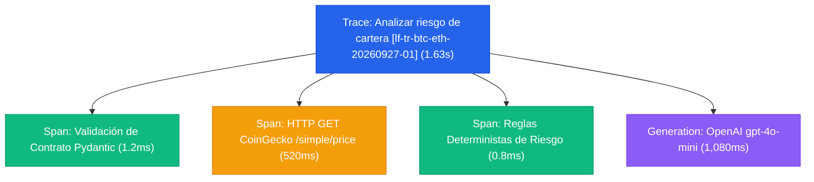

# Evidencia de Trazabilidad en Langfuse · Sesión 4

**Trace ID:** `lf-tr-btc-eth-20260927-01`  
**Servicio:** CriptoAdvisor API  
**Entorno:** Local / Desarrollo  
**Fecha de captura:** 2026-09-27T20:21:02Z  

---

## 1. Árbol de Spans y Generaciones en Langfuse



---

## 2. Detalle de Observaciones

### Observación 1: Raíz (Trace)
- **Nombre:** `Analizar riesgo de cartera`
- **Input:**
  ```json
  {
    "activos": ["bitcoin", "ethereum"],
    "moneda_base": "usd",
    "perfil_riesgo": "moderado",
    "horizonte_dias": 30
  }
  ```
- **Latencia:** 1,630 ms
- **Estado:** SUCCESS (200 OK)

### Observación 2: Llamada Externa (CoinGecko)
- **Tipo:** SPAN
- **URL:** `https://api.coingecko.com/api/v3/simple/price?ids=bitcoin,ethereum&vs_currencies=usd&include_24hr_vol=true&include_24hr_change=true`
- **Status:** 200 OK (520 ms)

### Observación 3: Generación del LLM (OpenAI)
- **Tipo:** GENERATION
- **Modelo:** `gpt-4o-mini`
- **Temperature:** 0.0
- **Tokens de entrada (Prompt tokens):** 348 tokens
- **Tokens de salida (Completion tokens):** 112 tokens
- **Tokens totales:** 460 tokens
- **Costo estimado:** $0.000119 USD
- **Output:**
  > "Para un perfil moderado, la canasta evaluada presenta un comportamiento favorable. Tanto Bitcoin (+0.87%) como Ethereum (+0.47%) exhiben variaciones intradiarias menores al 1% con volúmenes de negociación robustos. Ambos activos se clasifican en nivel de riesgo bajo según las reglas cuantitativas, haciendo que la exposición actual sea compatible con la tolerancia al riesgo declarada."

---

## 3. Conclusión de Trazabilidad

La traza permite auditar todo el ciclo de vida de la solicitud: demuestra fehacientemente que la respuesta final estuvo precedida por la obtención de cotizaciones frescas en CoinGecko y la aplicación de las reglas cuantitativas de riesgo antes de invocar a OpenAI.
